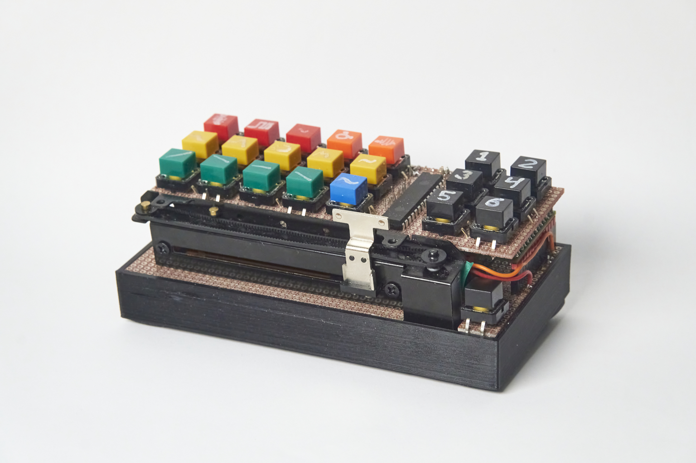
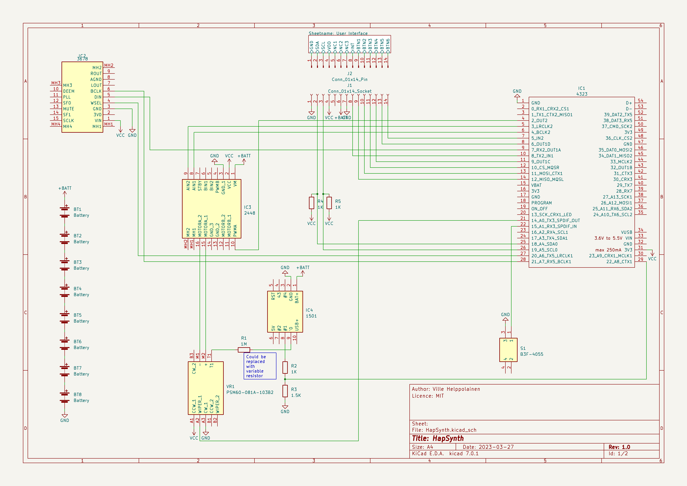
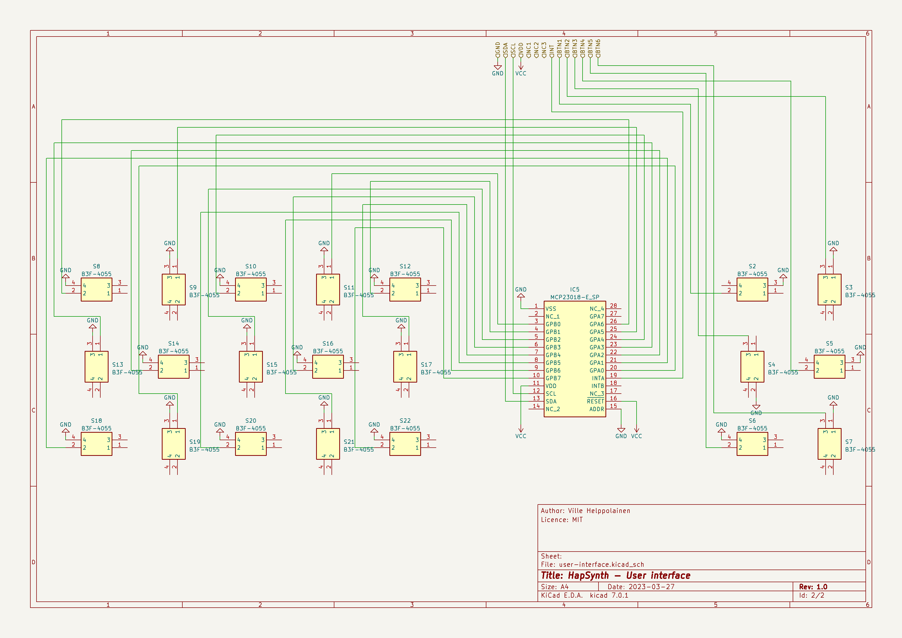

# HapSynth

An 8-voice digital substractive synthesizer with motorized slider for haptic feedback.

## Demo

[https://www.youtube.com/watch?v=hl_LQ_ap-Gw](https://www.youtube.com/watch?v=hl_LQ_ap-Gw)

## Schematics

